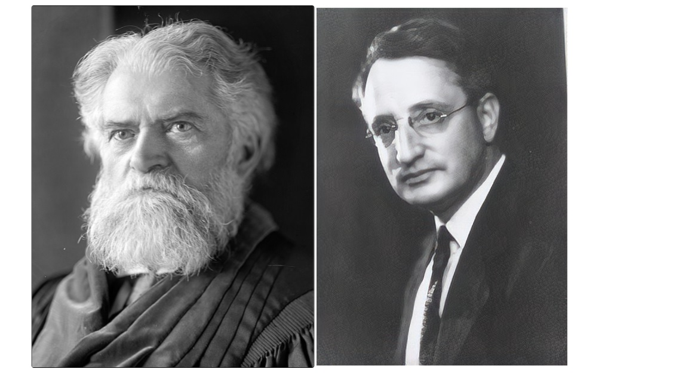
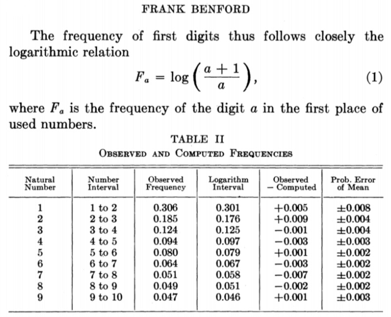
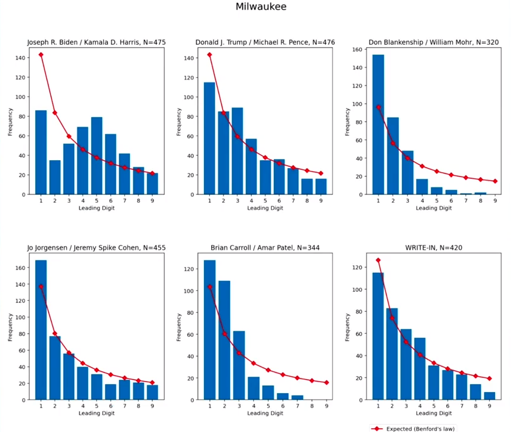

*Presented on April 2nd, 2021* 

*Edited on May 12, 2021*

```{r  setup, include=F}
library(tidyverse)
library(scales)
library(odbc)

knitr::opts_chunk$set(echo = FALSE, message = FALSE, error = FALSE,
                      warning = FALSE, fig.width = 7, fig.height = 4)

theme_set(theme_light())

```

## Introduction

Benford's Law (also known as the first digit Law, Newcomb-Benford Law, or Law of Anomalous Numbers) is an observation about the frequency distribution of of leading digits in many real-life sets of numerical sets of numerical data. Essentially, the law states that in many naturally occurring numbers, the leading digit is likely to be small. This would mean that smaller numbers will appear more frequently than larger numbers

The formula for the law follows:

$$P\{d\} = \log_{10}\left(\frac{d+1}{d}\right)$$ Where *d* is the leading digit (1-9).

For example, the probability of the first digit being 1 is:

$$P\{1\} = \log_{10}\left(\frac{1+1}{1}\right) \approx 0.301$$

The following images shows the probability distribution and table for all digits:

```{r fig.align='center',cache=T}
benford=function(d){
  return(log(1+1/d)/log(10))
}

benford<-data.frame(x=1:9) %>% 
  mutate(y=benford(x))
benford %>% 
  ggplot(aes(x=x,y=y))+
  geom_col(color='black',fill='red4')+
  scale_x_continuous(breaks=1:9)+
  scale_y_continuous(labels = percent)+labs(x='Leading Digit',y='Probability %',title='Distribution of Leading Digits by Benford\'s Law')

benford1=benford %>% 
  mutate(y=percent(y,accuracy = .1)) %>% 
  pivot_wider(names_from = x,values_from = y)

rownames(benford1)=c('%')

knitr::kable(benford1,
  caption = 'Distribution of Leading Digits by Benford\'s Law',row.names = T) %>% 
  kableExtra::kable_styling(full_width = F)
  
```

Benford's law can also be used to make predictions about what the second, third, and subsequent leading digits will be, which would would also entail being able to predict certain number combinations. The probability of digits 0-9 (denoted as d) being in the nth place (n\>1) is:

$$\sum_{k=10^{n-2}}^{10^{n-1}-1}log_{10}\left(1+ \frac{1}{10k +d}\right)$$


## History

Benford (the law's namesake) was not the first one to study this phenomenon.Simon Newcomb, a Canadian astronomer, published his finding on this phenomenon in 1881. In 1938, American physicist Frank Benford repopularized this concept.



Both noticed that many diverse data sets closely adhered to the following distribution of digits, such that it resembled a logarithmic relation.

Here is an excerpt from Benford's paper "The Law of Anomalous Numbers", 1938 Public Domain:



## Practical uses

Benford's Law works best when applied to large sets of naturally occurring numbers. Such as, but not limited to:

-   Companies' stock market values,
-   Data found in texts --- like the Reader's Digest, or a copy of Newsweek.
-   Demographic data, including state and city populations,
-   Income tax data,
-   Mathematical tables, like logarithms,
-   River drainage rates,
-   Scientific data

One practical use is to detect fraud and error detection. Since it is expected that large numbers will follow the law, Benford's law can be used as a benchmark of what normal levels of particular number in a set are.

One famous example of the use of the law was suggesting there was fraud in the 2009 Iranian election. An analysis showed that President Mahmoud Ahmadinejad, the winner of the election, tended to differ significantly from the expectations of Benford's law, and that the ballot boxes with very few invalid ballots had a greater influence on the results, suggesting widespread ballot stuffing.

It is important to understand that results that do not follow Benford's Law does not necessarily mean there is a fraud. The law can be used as a check to see if there is a possibility that there might be something nefarious.

## PGA Earnings

One real world example is to look at the distribution of PGA Earnings. 

```{r cache=T}
library(rvest)
lnk <- "https://www.pgatour.com/stats/stat.110.html"
lnk_read <- read_html(lnk) %>%
  html_table() %>%
  .[[2]] %>%
  as_tibble() 
head(lnk_read)
```

```{r}
pgaDigits<-lnk_read %>% 
  mutate(MONEYDigit=str_extract(MONEY,'[0-9]')) %>% 
  count(MONEYDigit) %>% 
  mutate(p=n/sum(n))

pgaDigits %>% 
  ggplot(aes(x=MONEYDigit,y=p))+
  geom_col(color='black',fill='steelblue1')+
   geom_point(data=benford,mapping = aes(x=x,y=y))+
geom_line(data=benford,mapping = aes(x=x,y=y),size=1.5)+
  scale_x_discrete(breaks=1:9,name='Leading Digit')+
  scale_y_continuous(name='% Appearing',labels = percent)+
  ggtitle('Evaluating PGA Earnings with Benford\'s Law')+labs(caption = 'Bar graph shows PGA results. Line shows Benford\'s Law Probability')

pgaDigits1<-pgaDigits %>% 
  mutate(p=percent(p,accuracy = .1),y=percent(benford$y,accuracy = .1)) %>% 
  select(-n)

knitr::kable(pgaDigits1,
             col.names = c('Leading Digit','Results from Data','Benford\'s Law Probability'),
             caption = 'Evaluating PGA Earnings Data with Benford\'s Law') %>% 
  kableExtra::kable_styling(position = "center")
```

Although the results slightly differ from Benford's Law (9 appears more than 8 for example), the general trend is about the same, such that we see more smaller number than bigger numbers. Good to see there is no money fraud in the PGA!

## Voter Fraud? 

In the 2020 election between Biden and Trump, there has been arguments that there was voter fraud, resulting in Biden's victory. The graph below shows that in wards in Milwaukee, the Biden/Harris campaign received vote counts with first digits between 4-7 the majority of the time, a definite anomaly from Benford's Law. 

 

However, Benford's Law should not be used to indicate there is fraud, **but rather as a first pass to something suspicious**. Further research in the Milwaukee results shows that the number of total votes in Milwaukee wards is narrow, with half of wards having total votes between 570 and 1200, with the logarithmic average of 800. Since Biden received about 70% of votes in Milwaukee, we can reasonably assume that Biden votes from wards would be between around 400 to 840 (average is 560). This would make sense that Biden's leading numbers would mostly be between 4-7.

## Additional Resources

-   [Statistics How To Reference](https://www.statisticshowto.com/benfords-law/#:~:text=What%20is%20Benford's%20Law%3F,one%20out%20of%20nine%20digits)
-   [Toward Data Science Reference](https://towardsdatascience.com/benfords-law-a-simple-explanation-341e17abbe75)
-   [Wikipedia Reference](https://en.wikipedia.org/wiki/Benford%27s_law)
-   [The Law of Anomalous Numbers](https://www.jstor.org/stable/984802?seq=1#metadata_info_tab_contents)
-   [Iranian Election Paper](http://www-personal.umich.edu/~wmebane/note22jun2009.pdf)
-   [2020 Election Benford's Law Paper](http://www-personal.umich.edu/~wmebane/inapB.pdf)
